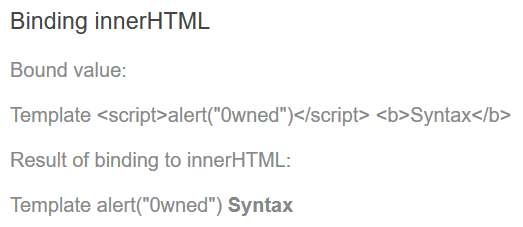
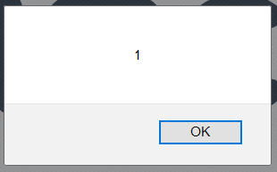
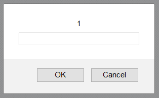

How To Prevent
==============

As we previously saw, XSS can be grouped into server and client XSS, thus
mitigation should be done on both sides.

In this section, we will cover how to prevent XSS using Vanilla JavaScript,
introduce the [xss-filters Node.js package][1], and in addition to how to do it
client-side with React and AngularJS.

## Vanilla JavaScript

One of the required steps to handle this type of issue is to escape the HTML by
replacing its special characters with their corresponding entities.

As of JavaScript 1.5 (ECMAScript v3), there are two built-in functions that
encode special characters preventing the payload to be executed as part of
server's HTTP response.

Considering the following input;

```
http://example.com/news/1?comment=<script>alert(XSS1)</script>
```

* `encodeURIComponent` function won't encode `~!*()'"`. It is intended to encode
  strings to be used as part of an URI like query string parameters.

  ```
  http%3A%2F%2Fexample.com%2Fnews%2F1%3Fcomment%3D%3Cscript%3Ealert(XSS1)%3C%2Fscript%3E
  ```

* `encodeURI`  function encodes all special characters except `,/?:@&=+$#'`.
  Unlike the `encodeURIComponent`, this function is aimed for URIs.

  ```
  http://example.com/news/1?comment=%3Cscript%3Ealert(XSS1)%3C/script%3E
  ```

Note that none of the `encodeURIComponent()` or `encodeURI()` functions
escape the `'` (single quote) character, as it is a valid character for URIs.

The `'` character is commonly used as an "alternative" to `"` (double quote) for
HTML attributes, e.g. `href='MyUrl'`, which may introduce vulnerabilities. As it
won't be escaped input that includes it will break the syntax resulting in an
injection.

If you are constructing HTML from strings, either use `"` instead of `'` for
attribute quotes, or add an extra layer of encoding (`'` can be encoded as
`%27`).

## Node.js

Both `encodeURI` and `encodeURIComponent` functions are available on Node.js
global scope[^1], but more specialized packages like the [xss-filters][1] are
available in [npm][2].

The following sample source code demonstrates how to use [xss-filters
package][1] withing an [Express][2] web application:

```javascript
const express = require('express');
const xssFilters = require('xss-filters');
const util = require('util');

const app = express();

app.get('/', (req, res) => {
  const unsafeFirstname = req.query.firstname;
  const safeFirstname = xssFilters.inHTMLData(unsafeFirstname);

  res.send(util.format('<h1>Hello %s</h1>', safeFirstname));
});

app.listen(3000);
```

Notice that while dealing with untrusted user input which should be later on
outputted into HTML pages, first we pass it through the `xssFilters.inHTMLData()`
function to get properly encoded output.

There are a few warnings that accompany this package, namely:

* Filters **MUST ONLY** be applied to UTF-8 encoded documents[^2].
* **DON'T** apply any filters inside any _scriptable_ contexts, i.e.,
  `<script>`, `<style>`, `<object>`, `<embed>`, and `<svg>` tags as well as
  `style=""` and `onXXX=""` (e.g., `onclick`) attributes. It is unsafe to permit
  untrusted input inside a _scriptable_ context.

## AngularJS

Angular already has some built-in protections to help developers dealing with
output encoding and XSS mitigation.

By default, all values are considered untrusted/unsafe. This means that whenever
a value is inserted into the DOM from a `template`, `property`, `attribute`,
`style`, `class binding` or `interpolation` Angular sanitizes and escapes it.

AngularJS developers should be aware that Angular templates are the same as
executable code thus template source code should not be generated by user
input concatenation. The [offline template generator][5] should be used instead.

Sanitization example as per the documentation:

```javascript
export class InnerHtmlBindingComponent {
  // For example, a user/attacker-controlled value from a URL.
  htmlSnippet = 'Template <script>alert("0wned")</script> <b>Syntax</b>';
}
```

```html
<h3>Binding innerHTML</h3>

<p>Bound value:</p>
<p class="e2e-inner-html-interpolated">{{htmlSnippet}}</p>

<p>Result of binding to innerHTML:</p>
<p class="e2e-inner-html-bound" [innerHTML]="htmlSnippet"></p>
```

Note that in the presented code snippet there are two types of content:

* Interpolated content - `{{htmlSnippet}}}`
* HTML property binding - `[innerHTML]="htmlSnippet"`

Interpolated content is always escaped, meaning that the HTML isn't interpreted
and the browser displays angle brackets as text. On the other hand, property
binding such as `innerHTML` may lead to XSS - **DO NOT** bind untrusted data.

As Angular recognizes the `<script>` tag and its content as unsafe, they will
be automatically sanitized. As so, the result of the previous snippets will look
like;

<div style="text-align: center">

</div>

While developing with AngularJS, developers should avoid the native DOM API as
it does not include security mechanisms. This is a common move when looking to
build complex dynamic forms. To do so securely, read [Angular's dynamic forms
guide][6].

Another vulnerability that Angular developers should be aware of is the
[Cross-Site Script Inclusion (XSSI)][7] which is also known as the JSON
vulnerability. 
To prevent this, use the `HttpClient` library in order to strip the string
`")]}',\n"` from all responses before further parsing.

Finally, there are rare legitimate cases where applications need to include
executable code. With Angular, developers should inject [DomSanitizer][8] and
call one of the following methods:

* `bypassSecurityTrustHtml`
* `bypassSecurityTrustScript`
* `bypassSecurityTrustStyle`
* `bypassSecurityTrustUrl`
* `bypassSecurityTrustResourceUrl` 

## React

React introduced `JSX` - a syntax extension to JavaScript, to specify React
elements.

By default, React DOM escapes any values embedded in JSX before rendering them.
This means that you can never inject anything that isn't explicitly written in
your application. This is a great feature and a huge help with XSS mitigation.

But... React also offers the `dangerouslySetInnerHTML` function which, as the
name suggests, will render the input as HTML. React developers may compromise
security while using it - where a XSS vector would previously fail due to being
treated as plain text, now it will be rendered as HTML.

`dangerouslySetInnerHTML` use should be totally avoided and it should be
something to look at carefully during code review.

The following snippet demonstrates how bad `dangerouslySetInnerHTML` can be

```javascript
function possibleXSS () {
  return { __html: '</img>' };
};

const App = () => (
  <div dangerouslySetInnerHTML={possibleXSS()} />
);

render(<App />, document.getElementById('root'));
```

resulting into

<div style="text-align: center">

</div>

Another React related security issue developers must be aware of is the
usage of user input as `href` attribute value. This will allow an attacker
to inject JavaScript, bypassing React security mechanisms.

```html
<div id="root">
</div>
```

```JavaScript
// ...

// Get user input from URI
const query = getQueryParams(document.location.search);

ReactDOM.render(
  <a href={query.page}>Click me!</a>,
  document.getElementById('root')
);
```

The URL `http://example.com?page=JavaScript:prompt(1)` will trigger the
following prompt dialog

<div style="text-align: center">

</div>

[^1]: The Node.js version of both `encodeURI` and `encodeURIComponent` functions does escape the single quote character `'`
[^2]: See how to properly [encode data to a common character set][4].

[1]: https://www.npmjs.com/package/xss-filters
[2]: https://www.npmjs.com/
[3]: https://expressjs.com/
[4]: ../input-validation/data-types/strings.md#encode-data-to-a-common-character-set
[5]: https://angular.io/guide/security#offline-template-compiler
[6]: https://angular.io/guide/dynamic-form
[7]: https://security.googleblog.com/2011/05/website-security-for-webmasters.html
[8]: https://angular.io/api/platform-browser/DomSanitizer
