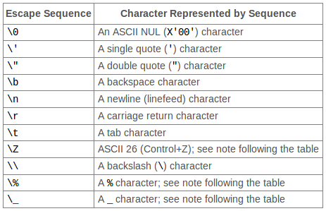

SQL Injection
=============

When using SQL databases one of the most common attacks is called SQL injection.
SQL injection attacks relate to the way databases handle requests.
Essentially it's the manipulation of the database query to do something it was
not intended.

As a simple analogy, consider a robot that follows the following command issued
by a user:  
`Get car number ___ from garage ___ and paint it ___`

Which means that if a user requested car number `1` from garage `3` and paint it
 `red` the query would become:
 `Get car number 1 from garage 3 and paint it red`

 But if a user submitted something that wasn't supposed to? Well, the database has
 no way of knowing what you are doing, it's simple following the instructions that
 it told.

 So if a user would change the previous query to say:
 `Get car number 1 from garage 3 and remove it's wheels. and paint it red.`

The robot would proceed to do as told and remove the car's wheels. This is
called an injection attack.

## Node.js and MySQL

Now for something more hands-on, a simple node.js app using MySQL to explain
SQL injection.

The application gets a username from the URL and then queries the database for all
the information regarding this user.

The problem comes from the URL parameter being used to make the SQL query. Since
the parameter in the URL is user input, unless some precautions are taken, an
attacker could manipulate the URL parameter to perform an injection attack.

The appplication code:

```javascript
var http = require('http')
var url = require('url')
var mysql = require('mysql')

var con = mysql.createConnection({
  host: "localhost",
  user: "dbadmin",
  password: "dbpass",
  database: "exampledb"
});

function getEmail(data, callback){
  con.query("SELECT * FROM users WHERE username = " + param , function(err, rows){
      if (err){
        callback(err, null)
      } else {
        callback(null, rows[0].)
      }
  });
}

http.createServer(function (req, res){
  var param = url.parse(req.url, true).query

  con.connect(function(err){
    if (err) throw err;
    getEmail(param, function(err, content) {
      if (err) console.log(err)
      else {
        res.end(JSON.stringify(content));
      }
    })
  });


}).listen(3000);
console.log("Server running at http://localhost:3000");
```

The attacker could change the URL parameter to `1' or 1=1--` which would "trick"
the database into returning all the users in the table.

### How to fix?

There are to ways to approach this problem.
One is by encoding special characters to their hexadecimal representation. This
is usually referred to as `escaping` and the following methods can be used:  

  1 - `mysql.escape()`  
  2 - `connection.escape()`  
  3 - `pool.escape()`  

The charaters considered "special characters" are the following:

  
[Source - dev.mysql.com][1]

Alternatively you can use the `?` as character placeholders for identifiers to
be escaped. If using placeholders then the SQL query of the vulnerable app
presented above would be:
```javascript
[...]
  con.query("SELECT * FROM users WHERE username = ?" + param, function(err, rows){
    //do stuff
  });
[...]
```  

Another way to prevent this attack is to use `prepared statements`.
There are some benefits to using this method.

From the MySQL documentation:
> - Less overhead for parsing the statement each time it is executed. Typically,
database applications process large volumes of almost-identical statements, with
only changes to literal or variable values in clauses such as `WHERE` for queries
and deletes, `SET` for updates, and `VALUES` for inserts.

> - Protection against SQL injection attacks. The parameter values can contain
unescaped SQL quote and delimiter characters.

If using prepared statements, then our previously vulnerable query would now be
written as:
```javascript
  var sql = "SELECT * FROM ?? WHERE ?? = ?";
  var inserts = ['users', 'username', param]
  sql = mysql.format(sql, inserts);
  con.query(sql, function(err, rows){
    //do stuff
  });
```

By following this, the result is a valid and escaped query that can safely be
sent to the database.

//TODO: TESTAR CODIGO
[1]:http://TODO
